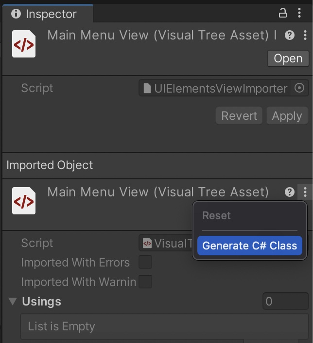

# UXML C# Class Generation

You can generate a partial C# class from UXML file.
This class will contain field declarations and method that assigns them.
As long as this generated class exists it will be automatically regenerated on each change to corresponding UXML file.

## How to generate a c# class from UXML file?
1. Select UXML file
2. In the inspector window, right click the header area or click on the three dots header button.
3. Click "Generate C# Class" menu item



## How do I use partial classes? What is a partial class?

[MS Docs](https://docs.microsoft.com/en-us/dotnet/csharp/programming-guide/classes-and-structs/partial-classes-and-methods).
In short a partial class allows you to split class definition over more than one file, it is usually used with code generation features.

Lets say you already generated the C# class from your UXML file, it looks like this:

```csharp
partial class MainMenuView
{
    private Label titleLabel;

    protected void AssignQueryResults(VisualElement root)
    {
        titleLabel = root.Q<Label>("title-label");
    }
}
```

In order to use it create a new C# class with the same name and `partial` keyword:

```csharp
public partial class MainMenuView : MonoBehaviour
{
    [SerializeField]
    private UIDocument uiDoc;

    private void OnEnable()
    {
        AssignQueryResults(uiDoc.rootVisualElement);
        titleLabel.text = "Super Game";
    }
}
```
Because you create a new class with the same name and partial keyword now to can reference and use every class member defined in the other file.
Couple of additional notes:
- You don't have to add access modifiers (internal/public) to all partial class definitions.
- You can still derive from any other class in your second partial class definition.
- Both C# files must exist in the same assembly for partial classes to work.
  - Use `AssemblyDefinitionAsset` and `AssemblyDefinitionReferenceAsset` to control how your assemblies are built. [documentation](https://docs.unity3d.com/Manual/ScriptCompilationAssemblyDefinitionFiles.html)

## How to change generated class namespace?

The namespace of a class is determined by following factors:

1. If `AssemblyDefinitionAsset` or `AssemblyDefinitionReferenceAsset` exists in the UXML directory or parent directory: `AssemblyDefinitionAsset.rootNamespace` will be used.
2. If `AssemblyDefinitionAsset.rootNamespace` is empty `AssemblyDefinitionAsset.name` will be used instead.
3. If the UXML file is inside Assets folder, the `EditorSettings.projectGenerationRootNamespace` will be used.
4. If none of the above conditions are met, class will have no namespace.

## Can I modify generated class in any way?

You can add a prefix to generated field names.
To do that, edit your UXML file and add `code-gen-prefix` attribute to the root UXML tag.
in the end UXML will look similar to this:
```xml
<ui:UXML code-gen-prefix="_" xmlns:ui="UnityEngine.UIElements" xsi="http://www.w3.org/2001/XMLSchema-instance"  >
    <ui:VisualElement>
        <ui:Label text="Label"/>
    </ui:VisualElement>
</ui:UXML>
```