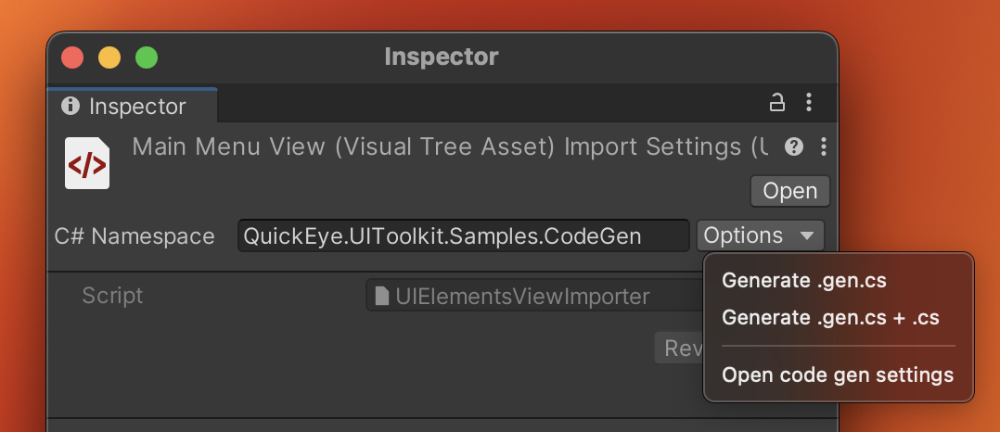

# UI Code Generation

You can generate a partial C# class from the UXML file.
This class will contain field declarations and the method that assigns them.
As long as this generated class exists it will be automatically regenerated on each change to the corresponding UXML file.

## How to generate a c# class from UXML file?
1. Select the UXML file
2. In the inspector window, select _**Generate .gen.cs**_ or _**Generate .gen.cs + .cs**_ menu item from **Options** dropdown menu

## How to change generated class namespace?

The namespace of a class is determined by the following factors:

1. If `gen-cs-namespace` attribute in the `UXML` tag of the UXML file exists, its value will be used. This can be set from the UXML importer inspector header.
2. If `AssemblyDefinitionAsset` or `AssemblyDefinitionReferenceAsset` exists in the UXML directory or parent directory: `AssemblyDefinitionAsset.rootNamespace` will be used.
3. If `AssemblyDefinitionAsset.rootNamespace` is empty `AssemblyDefinitionAsset.name` will be used instead.
4. If the UXML file is inside the Assets folder, the `EditorSettings.projectGenerationRootNamespace` will be used.
5. If none of the above conditions are met, the class will have no namespace.

## Can I modify generated class in any way?

Settings for code generation can be modified from the project settings window.
_Project Settings/UI Code Generation_

## How do I use partial classes? What is a partial class?

[MS Docs](https://docs.microsoft.com/en-us/dotnet/csharp/programming-guide/classes-and-structs/partial-classes-and-methods).
In short a partial class allows you to split class definition over more than one file, it is usually used with code generation features.

An example of partial class usage can be found in the package sample "UI Code Generation". Available in the Package Manager Window.
