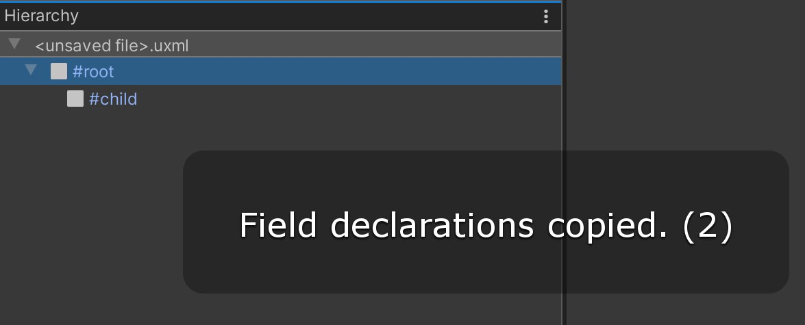

# UI Toolkit Plus
[](https://github.com/ToshikiImagawa/Variable-infinite-scroll/blob/master/LICENSE.md)

[](https://openupm.com/packages/com.quickeye.uitoolkitplus/)
### About
Library mostly made of of extension methods. Created to cut down the boilerplate code, that I wrote in every UI Toolkit related scripts.

### QAttribute Example

##### Standard VisualElement assigment
```csharp
public class ExampleEditorWindow 
{
    ObjectField objField;
    ListView listView;
    Label label;
    
    void OnEnable()
    {
      objField = rootVisualElement.Q<ObjectField>("objField");
      listView = rootVisualElement.Q<ListView>("listView");
      label = rootVisualElement.Q<Label>("label");
    }
}
```
##### QAttribute
```csharp
public class ExampleEditorWindow 
{
    [Q("objField")] ObjectField objField;
    [Q("listView")] ListView listView;
    [Q("label")] Label label;
    
    void OnEnable()
    {
      rootVisualElement.AssignQueryResults(this);
    }
}
```
`QAttribute` marks the class member as a query target, and the `AssignQueryResults` extension method assigns appropriate UQuery results to those members.

### Copy Field Declarations (UI builder)

Select visual element in your UI Builder hierarchy and use `UI Builder/Copy Field Declarations` shortcut (Alt + C).
This will copy C# field declarations for the selected visual element and its children.



Copied C# field declarations:

```csharp
    [Q("root")]
    private VisualElement root;
    [Q("child")]
    private VisualElement child;
```

