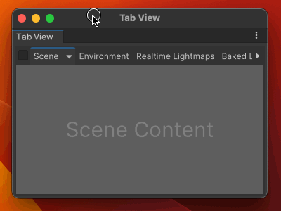

# UI Toolkit Plus
[](https://github.com/ToshikiImagawa/Variable-infinite-scroll/blob/master/LICENSE.md)

[](https://openupm.com/packages/com.quickeye.ui-toolkit-plus/)

### About
Reusable features for UI Toolkit runtime and editor.


### UXML C# Script generation

You can generate partial C# class from UXML file. 

Given the following UXML:
```xml
<ui:VisualElement>
    <ui:Label name="title" />
</ui:VisualElement>
<ui:VisualElement name="menu">
    <ui:Button name="confirm-button" />
</ui:VisualElement>
```
Tool generates C# script:
```csharp
partial class UXMLFileName
{
    private Label title;
    private VisualElement menu;
    private Button confirmButton;

    private void AssignQueryResults(VisualElement root)
    {
        title = root.Q<Label>("title");
        menu = root.Q<VisualElement>("menu");
        confirmButton = root.Q<Button>("confirm-button");
    }
}
```

[Detailed documentation about code generation](Documentation~/UxmlCodeGeneration.md)

### Style Sheet Exporter
> Open from context menu: __Window/UI Toolkit/Style Sheet Exporter__  
> Available with Unity 2022.1 and newer

Ever wanted to see how Unity built-in controls are styled? With this tool you can!
Export style sheet assets used by Unity Editor to USS files.


### QAttribute Example
> Alternative to code generation for query assignment
##### Standard VisualElement assigment
```csharp
public class ExampleEditorWindow 
{
    ObjectField objField;
    ListView listView;
    Label label;
    
    void OnEnable()
    {
      objField = rootVisualElement.Q<ObjectField>("objField");
      listView = rootVisualElement.Q<ListView>("listView");
      label = rootVisualElement.Q<Label>("label");
    }
}
```
##### QAttribute
```csharp
public class ExampleEditorWindow 
{
    [Q("objField")] ObjectField objField;
    [Q("listView")] ListView listView;
    [Q("label")] Label label;
    
    void OnEnable()
    {
      rootVisualElement.AssignQueryResults(this);
    }
}
```
`QAttribute` marks the class member as a query target, and the `AssignQueryResults` extension method assigns appropriate UQuery results to those members.

### Copy Field Declarations (UI builder)

Select visual element in your UI Builder hierarchy and use `UI Builder/Copy Field Declarations` shortcut (Alt + C).
This will copy C# field declarations for the selected visual element and its children.


Copied C# field declarations:

```csharp
    [Q("root")]
    private VisualElement root;
    [Q("child")]
    private VisualElement child;
```

### `ReorderableManipulator`


### `TabGroup` and `Tab`


